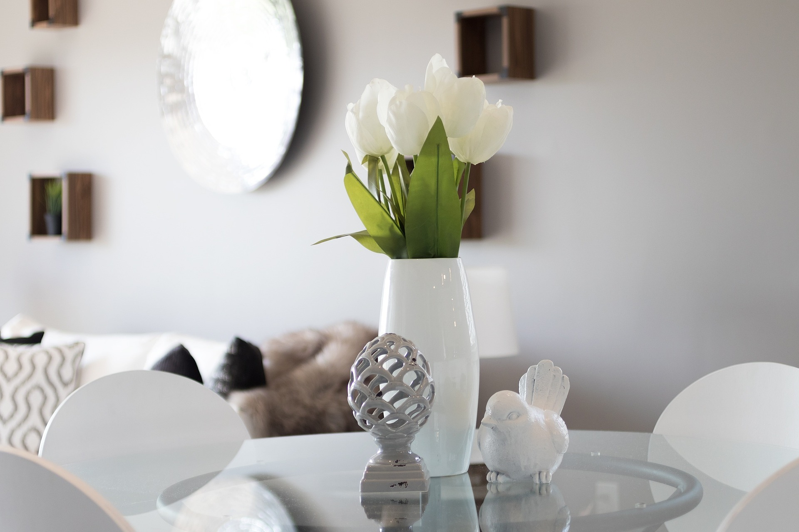
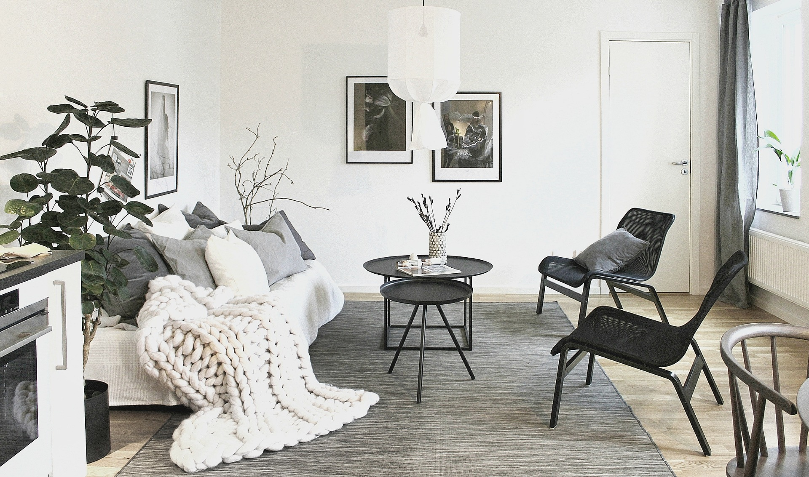
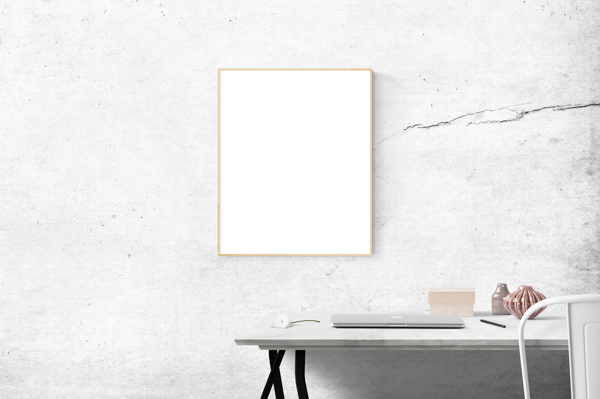

---

Iată câteva servicii de care te poti bucura daca apelezi la noi:

1. Planificarea spațiului: Aceasta implică crearea unei planificări pentru un spațiu care optimizează funcționalitatea și fluxul acestuia.

2. Dezvoltarea conceptului: Aceasta implică dezvoltarea unui concept vizual pentru un spațiu, bazat pe nevoile și preferințele clientului.

3. Selecția materialelor și finisajelor: Aceasta implică selectarea materialelor și finisajelor pentru suprafețe precum podele, pereți și blaturi.

4. Consultanță în ceea ce privește culorile: Aceasta implică selectarea culorilor pentru un spațiu care sunt estetic plăcute și care completează preferințele clientului.

5. Selecția și achiziționarea mobilierului: Aceasta implică selectarea mobilierului care se potrivește cu conceptul de design și aranjarea achiziționării și livrării acestuia.

6. Managementul de proiect: Aceasta implică supravegherea întregului proces de design, de la dezvoltarea conceptului până la instalare, pentru a asigura că proiectul este finalizat la timp și în cadrul bugetului.

---

## Alte detalii

